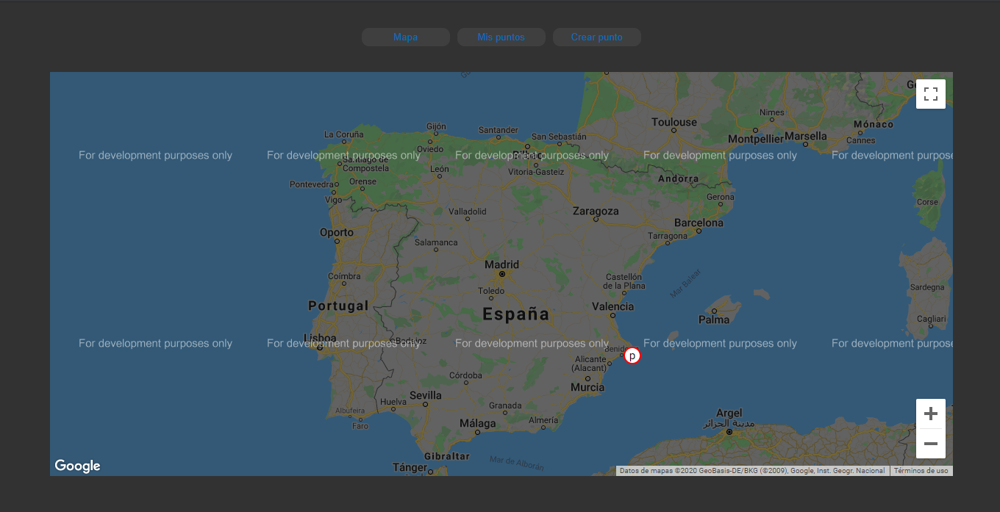

## Mi Mapa

### Es una pequeña aplicación que te permite añadir y borrar puntos en un mapa de google

### Puedes probar la demo aquí [Demo](https://mimapa-640ff.web.app/)

#### Para ejecutarlo de forma local hará falta que crees un archivo "credentials.js" en la raíz de la aplicación con tu apikey de google. Puedes escribirlo de la siguiente manera:

`export const Credentials = {
	ApiKey: "AQUI_TU_API_KEY"
}`

#### Después para ejecutarla usa el comando:

`npm start`

#### La aplicación debería verse así

#### Saque la idea para este proyecto del canal de youtube [HolaMundo](https://www.youtube.com/channel/UC4FHiPgS1KXkUMx3dxBUtPg). El cual tiene un vídeo dando ideas de proyectos para un portafolios.